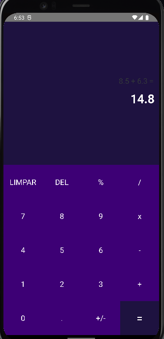

# Calculadora

* The "Calculator" project is an application developed in React Native with the aim of creating a functional calculator with an interactive and modern design, inspired by mobile device calculators.
* The application allows for a variety of mathematical operations to be performed conveniently and effectively, offering a user experience similar to that of calculators found on smartphones.

* The "Calculator" app's interface is designed to be intuitive and easy to use, with buttons and design elements reminiscent of mobile device calculators.
* The calculator offers standard functionalities such as addition, subtraction, multiplication, division, and other operations, providing a reliable tool for everyday calculations.
 
## Table of contents

- [Overview](#overview)
  - [Built with](#built-with)
- [Author](#author)

## Overview

* Functional Calculator: The app offers a functional calculator that allows for precise mathematical operations.

* Interactive and Modern Design: The app's interface features an interactive and modern design, providing a pleasant user experience.

* Mobile-Like Experience: The interface and usability resemble those of smartphone calculators, making for an easy transition to the app.

* Various Mathematical Operations: In addition to basic operations, the calculator supports a variety of other operations, making it versatile for different needs.

* Ease of Use: The interface is designed with a focus on user-friendliness, making calculation operations simple and intuitive.

* Reliable Tool: The "Calculator" is a reliable tool for everyday calculations, offering precision and efficiency.

### Built with

- JS
- REACT-NATIVE

## Author

- Github - [#MyProfile](https://github.com/AlanDavid-007/Calculadora/)

### Screenshot 
 

 
